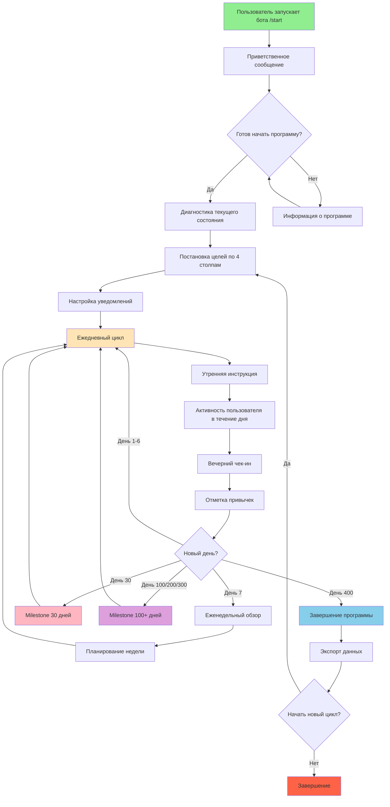
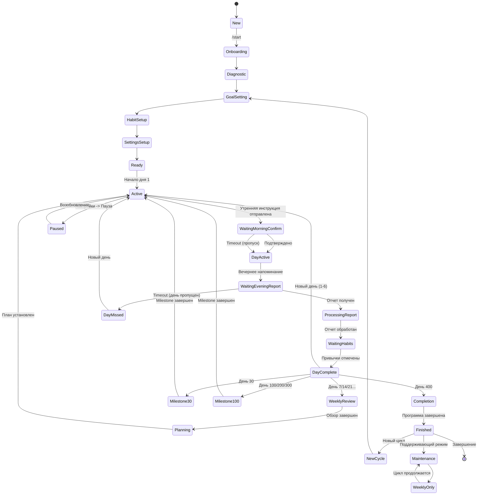
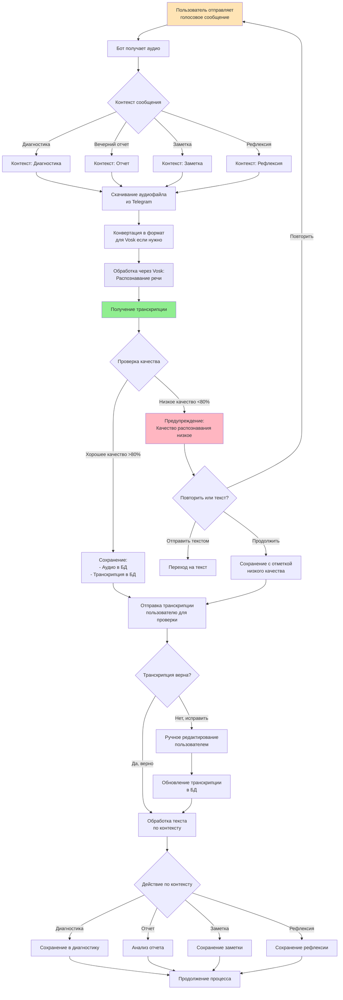
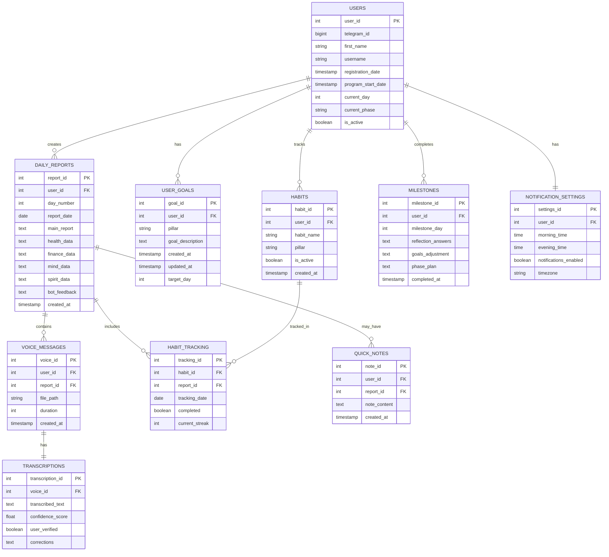

# User Flow: Telegram-бот "400 дней трансформации"

## 1. Общая структура User Flow



---

## 2. User Flow: Онбординг (Детализированный)

```mermaid
graph TB
    Start['/start'] --> Welcome[📱 Приветствие от бота]
    Welcome --> Intro1[Объяснение концепции: 400 дней трансформации]
    Intro1 --> Intro2[Описание 4 столпов:<br/>Здоровье, Финансы,<br/>Психика, Духовность]
    Intro2 --> Intro3[Объяснение структуры:<br/>Ежедневные ритуалы,<br/>Milestone, обратная связь]
    Intro3 --> Consent{Готов начать?}
    
    Consent -->|Да, начинаем!| CreateProfile[Создание профиля в БД]
    Consent -->|Пока нет| WaitMode[Режим ожидания]
    WaitMode --> ReturnLater[Можно вернуться через /start]
    
    CreateProfile --> DiagIntro[📊 Начало диагностики]
    DiagIntro --> DiagHealth[Вопросы по Здоровью:<br/>питание, движение, сон]
    
    DiagHealth --> InputType1{Формат ответа}
    InputType1 -->|Текст| SaveHealth[Сохранение ответа]
    InputType1 -->|Голос| VoiceHealth[Vosk транскрипция]
    VoiceHealth --> SaveHealth
    
    SaveHealth --> DiagFinance[Вопросы по Финансам:<br/>доход, расходы, цели]
    
    DiagFinance --> InputType2{Формат ответа}
    InputType2 -->|Текст| SaveFinance[Сохранение ответа]
    InputType2 -->|Голос| VoiceFinance[Vosk транскрипция]
    VoiceFinance --> SaveFinance
    
    SaveFinance --> DiagMind[Вопросы по Психике:<br/>стресс, фокус, дисциплина]
    
    DiagMind --> InputType3{Формат ответа}
    InputType3 -->|Текст| SaveMind[Сохранение ответа]
    InputType3 -->|Голос| VoiceMind[Vosk транскрипция]
    VoiceMind --> SaveMind
    
    SaveMind --> DiagSpirit[Вопросы по Духовности:<br/>ценности, смысл, практики]
    
    DiagSpirit --> InputType4{Формат ответа}
    InputType4 -->|Текст| SaveSpirit[Сохранение ответа]
    InputType4 -->|Голос| VoiceSpirit[Vosk транскрипция]
    VoiceSpirit --> SaveSpirit
    
    SaveSpirit --> Summary[📝 Формирование сводки<br/>текущего состояния]
    Summary --> GoalsIntro[🎯 Переход к целеполаганию]
    
    GoalsIntro --> GoalTemplates[Предложение шаблонов целей]
    GoalTemplates --> GoalHealth{Цель по Здоровью}
    
    GoalHealth -->|Свой вариант| CustomHealthGoal[Ввод цели]
    GoalHealth -->|Из шаблона| TemplateHealthGoal[Выбор из шаблона]
    CustomHealthGoal --> SaveGoalHealth[Сохранение цели]
    TemplateHealthGoal --> SaveGoalHealth
    
    SaveGoalHealth --> GoalFinance{Цель по Финансам}
    GoalFinance -->|Свой вариант| CustomFinanceGoal[Ввод цели]
    GoalFinance -->|Из шаблона| TemplateFinanceGoal[Выбор из шаблона]
    CustomFinanceGoal --> SaveGoalFinance[Сохранение цели]
    TemplateFinanceGoal --> SaveGoalFinance
    
    SaveGoalFinance --> GoalMind{Цель по Психике}
    GoalMind -->|Свой вариант| CustomMindGoal[Ввод цели]
    GoalMind -->|Из шаблона| TemplateMindGoal[Выбор из шаблона]
    CustomMindGoal --> SaveGoalMind[Сохранение цели]
    TemplateMindGoal --> SaveGoalMind
    
    SaveGoalMind --> GoalSpirit{Цель по Духовности}
    GoalSpirit -->|Свой вариант| CustomSpiritGoal[Ввод цели]
    GoalSpirit -->|Из шаблона| TemplateSpiritGoal[Выбор из шаблона]
    CustomSpiritGoal --> SaveGoalSpirit[Сохранение цели]
    TemplateSpiritGoal --> SaveGoalSpirit
    
    SaveGoalSpirit --> GoalsSummary[Показ всех установленных целей]
    GoalsSummary --> HabitsIntro[💪 Настройка ключевых привычек]
    
    HabitsIntro --> Habit1[Привычка 1]
    Habit1 --> Habit2[Привычка 2]
    Habit2 --> Habit3[Привычка 3]
    Habit3 --> HabitsOptional{Еще привычки?}
    HabitsOptional -->|Да, до 5| Habit4[Привычка 4-5]
    HabitsOptional -->|Нет| NotificationSettings
    Habit4 --> NotificationSettings
    
    NotificationSettings[⏰ Настройка времени уведомлений]
    NotificationSettings --> MorningTime[Время утренней инструкции<br/>по умолчанию 7:00]
    MorningTime --> EveningTime[Время вечернего напоминания<br/>по умолчанию 21:00]
    EveningTime --> ConfirmSettings[Подтверждение настроек]
    
    ConfirmSettings --> OnboardingComplete[✅ Онбординг завершен!]
    OnboardingComplete --> FirstDay[📅 День 1 начинается завтра]
    FirstDay --> WaitForMorning[Ожидание первой<br/>утренней инструкции]
    
    style Start fill:#90EE90
    style OnboardingComplete fill:#87CEEB
    style DiagIntro fill:#FFE4B5
    style GoalsIntro fill:#FFE4B5
    style HabitsIntro fill:#FFE4B5
    style NotificationSettings fill:#FFE4B5
```



---

## 3. User Flow: Ежедневный цикл

```mermaid
graph TB
    Morning[🌅 7:00 - Утренняя инструкция] --> MorningContent[Содержание инструкции:<br/>- Фокус дня<br/>- Задачи по столпам<br/>- Мотивационная цитата]
    MorningContent --> MorningConfirm{Пользователь подтверждает}
    
    MorningConfirm -->|Кнопка: Начинаю день| DayStarted[День начат ✓]
    MorningConfirm -->|Нет реакции| Reminder1[Напоминание через 1 час]
    Reminder1 --> Reminder2[Напоминание через 3 часа]
    Reminder2 --> SkipMorning[Пропуск утренней инструкции]
    
    DayStarted --> DayActivity[Активность в течение дня]
    SkipMorning --> DayActivity
    
    DayActivity --> QuickNotes{Быстрые заметки?}
    QuickNotes -->|Пользователь отправляет| NoteType{Тип сообщения}
    QuickNotes -->|Нет активности| Evening
    
    NoteType -->|Текст| SaveNoteText[Сохранение заметки]
    NoteType -->|Голос| TranscribeNote[Vosk транскрипция]
    TranscribeNote --> SaveNoteVoice[Сохранение заметки + аудио]
    SaveNoteText --> DayActivity
    SaveNoteVoice --> DayActivity
    
    Evening[🌙 21:00 - Вечернее напоминание]
    Evening --> EveningPrompt[Запрос вечернего отчета:<br/>Как прошел день?]
    
    EveningPrompt --> UserResponse{Пользователь отвечает}
    
    UserResponse -->|Текст| TextReport[Текстовый отчет]
    UserResponse -->|Голос| VoiceReport[Голосовой отчет]
    UserResponse -->|Нет ответа| EveningReminder1[Напоминание через 30 мин]
    
    EveningReminder1 --> EveningReminder2{Ответ после напоминания?}
    EveningReminder2 -->|Да| UserResponse
    EveningReminder2 -->|Нет до 23:59| MissedDay[День пропущен]
    
    TextReport --> AnalyzeReport[Анализ отчета]
    VoiceReport --> TranscribeVoice[Vosk транскрипция]
    TranscribeVoice --> ShowTranscription[Показать транскрипцию<br/>пользователю]
    ShowTranscription --> AnalyzeReport
    
    AnalyzeReport --> FollowUpQuestions[Уточняющие вопросы<br/>по 4 столпам]
    FollowUpQuestions --> QHealth[Здоровье: что ел,<br/>движение, сон]
    
    QHealth --> AHealth{Ответ}
    AHealth -->|Текст| SaveHealth[Сохранение]
    AHealth -->|Голос| VHealth[Транскрипция]
    VHealth --> SaveHealth
    
    SaveHealth --> QFinance[Финансы: расходы,<br/>доход, прогресс по целям]
    
    QFinance --> AFinance{Ответ}
    AFinance -->|Текст| SaveFinance[Сохранение]
    AFinance -->|Голос| VFinance[Транскрипция]
    VFinance --> SaveFinance
    
    SaveFinance --> QMind[Психика: уровень стресса,<br/>концентрация, эмоции]
    
    QMind --> AMind{Ответ}
    AMind -->|Текст| SaveMind[Сохранение]
    AMind -->|Голос| VMind[Транскрипция]
    VMind --> SaveMind
    
    SaveMind --> QSpirit[Духовность: практики,<br/>рефлексия, смысл]
    
    QSpirit --> ASpirit{Ответ}
    ASpirit -->|Текст| SaveSpirit[Сохранение]
    ASpirit -->|Голос| VSpirit[Транскрипция]
    VSpirit --> SaveSpirit
    
    SaveSpirit --> SaveReport[Полный отчет сохранен в БД]
    SaveReport --> Feedback[🤖 Обратная связь от бота:<br/>- Анализ дня<br/>- Паттерны<br/>- Рекомендации]
    
    Feedback --> HabitCheck[💪 Проверка привычек]
    HabitCheck --> HabitList[Список привычек с кнопками]
    HabitList --> Habit1{Привычка 1}
    
    Habit1 -->|✅ Выполнено| H1Done[Отметка в БД]
    Habit1 -->|❌ Не выполнено| H1Skip[Отметка в БД]
    H1Done --> Habit2
    H1Skip --> Habit2
    
    Habit2{Привычка 2}
    Habit2 -->|✅ Выполнено| H2Done[Отметка в БД]
    Habit2 -->|❌ Не выполнено| H2Skip[Отметка в БД]
    H2Done --> Habit3
    H2Skip --> Habit3
    
    Habit3{Привычка 3}
    Habit3 -->|✅ Выполнено| H3Done[Отметка в БД]
    Habit3 -->|❌ Не выполнено| H3Skip[Отметка в БД]
    H3Done --> HabitMore
    H3Skip --> HabitMore
    
    HabitMore{Еще привычки?}
    HabitMore -->|Да| Habit45[Привычки 4-5]
    HabitMore -->|Нет| HabitSummary
    Habit45 --> HabitSummary
    
    HabitSummary[Сводка по привычкам:<br/>- Streak продолжается<br/>- % выполнения]
    HabitSummary --> DayComplete[✅ День завершен!]
    
    MissedDay --> DayComplete
    
    DayComplete --> UpdateProgress[Обновление прогресса:<br/>- Счетчик дней +1<br/>- Обновление streak<br/>- Прогресс до milestone]
    
    UpdateProgress --> CheckDay{Какой день?}
    
    CheckDay -->|День 1-6| NextMorning[Следующее утро]
    CheckDay -->|День 7, 14, 21...| WeeklyFlow[➡️ Еженедельный обзор]
    CheckDay -->|День 30| Milestone30Flow[➡️ Milestone 30]
    CheckDay -->|День 100/200/300| Milestone100Flow[➡️ Milestone 100+]
    CheckDay -->|День 400| CompletionFlow[➡️ Завершение программы]
    
    NextMorning --> Morning
    
    style Morning fill:#FFE4B5
    style Evening fill:#E6E6FA
    style DayComplete fill:#90EE90
    style MissedDay fill:#FFB6C1
```



---

## 4. User Flow: Еженедельный обзор

```mermaid
graph TB
    Trigger[📅 День 7/14/21...<br/>Воскресенье вечер или<br/>Понедельник утро] --> WeeklyIntro[📊 Начало еженедельного обзора]
    
    WeeklyIntro --> Analyze[Анализ данных за неделю]
    Analyze --> CalcMetrics[Расчет метрик:<br/>- Активные дни<br/>- Streak<br/>- % выполнения привычек<br/>- Прогресс по столпам]
    
    CalcMetrics --> ReportHealth[🏃 Здоровье:<br/>- Основные паттерны<br/>- Улучшения<br/>- Проблемные зоны]
    
    ReportHealth --> ReportFinance[💰 Финансы:<br/>- Динамика доходов/расходов<br/>- Прогресс к целям<br/>- Рекомендации]
    
    ReportFinance --> ReportMind[🧠 Психика:<br/>- Уровень стресса<br/>- Концентрация<br/>- Эмоциональное состояние]
    
    ReportMind --> ReportSpirit[🕉️ Духовность:<br/>- Практики<br/>- Инсайты<br/>- Смысл и ценности]
    
    ReportSpirit --> Achievements[🏆 Достижения недели:<br/>- Выполненные задачи<br/>- Streak<br/>- Новые привычки]
    
    Achievements --> Challenges[⚠️ Вызовы и сложности:<br/>- Пропущенные дни<br/>- Невыполненные привычки<br/>- Паттерны прокрастинации]
    
    Challenges --> Reflection[💭 Вопросы для рефлексии:<br/>1. Что больше всего гордишься?<br/>2. Что было сложным?<br/>3. Что хочешь изменить?]
    
    Reflection --> UserReflects{Ответы пользователя}
    
    UserReflects -->|Текст| SaveReflectionText[Сохранение рефлексии]
    UserReflects -->|Голос| VoiceReflection[Vosk транскрипция]
    VoiceReflection --> SaveReflectionVoice[Сохранение рефлексии]
    UserReflects -->|Пропуск| SkipReflection[Продолжить без рефлексии]
    
    SaveReflectionText --> PlanningIntro
    SaveReflectionVoice --> PlanningIntro
    SkipReflection --> PlanningIntro
    
    PlanningIntro[🎯 Планирование следующей недели]
    PlanningIntro --> ChooseFocus[Выбор приоритетного столпа<br/>на неделю]
    
    ChooseFocus --> FocusPillar{Выбор}
    FocusPillar -->|Здоровье| FocusHealth[Фокус: Здоровье]
    FocusPillar -->|Финансы| FocusFinance[Фокус: Финансы]
    FocusPillar -->|Психика| FocusMind[Фокус: Психика]
    FocusPillar -->|Духовность| FocusSpirit[Фокус: Духовность]
    FocusPillar -->|Все равномерно| FocusBalanced[Сбалансированный фокус]
    
    FocusHealth --> SaveFocus[Сохранение выбора]
    FocusFinance --> SaveFocus
    FocusMind --> SaveFocus
    FocusSpirit --> SaveFocus
    FocusBalanced --> SaveFocus
    
    SaveFocus --> Top3Tasks[Установка 3 главных задач<br/>на неделю]
    Top3Tasks --> Task1[Задача 1]
    Task1 --> Task2[Задача 2]
    Task2 --> Task3[Задача 3]
    Task3 --> SaveTasks[Сохранение задач]
    
    SaveTasks --> HabitAdjust{Корректировать привычки?}
    HabitAdjust -->|Да| HabitChange[Изменение/добавление<br/>привычек]
    HabitAdjust -->|Нет| WeeklySummary
    HabitChange --> WeeklySummary
    
    WeeklySummary[📝 Итоговая сводка:<br/>- Фокус недели<br/>- 3 главные задачи<br/>- Привычки<br/>- Мотивация]
    
    WeeklySummary --> Motivation[💪 Мотивационное послание<br/>от бота]
    Motivation --> WeeklyComplete[✅ Обзор завершен]
    
    WeeklyComplete --> BackToDaily[Возврат к ежедневному циклу]
    BackToDaily --> NextMorning[Следующая утренняя инструкция]
    
    style Trigger fill:#FFE4B5
    style WeeklyIntro fill:#E6E6FA
    style PlanningIntro fill:#FFB6C1
    style WeeklyComplete fill:#90EE90
```



---

## 5. User Flow: Milestone 30 дней

```mermaid
graph TB
    Day30[📅 День 30 достигнут] --> Celebration[🎉 Поздравление!<br/>Завершена Фаза 1:<br/>Диагностика и фундамент]
    
    Celebration --> Stats[📊 Статистика 30 дней:<br/>- Активные дни<br/>- Streak<br/>- Выполнение привычек<br/>- Прогресс по столпам]
    
    Stats --> Comparison[⚖️ Сравнение с началом]
    Comparison --> CompareHealth[Здоровье: было → стало]
    CompareHealth --> CompareFinance[Финансы: было → стало]
    CompareFinance --> CompareMind[Психика: было → стало]
    CompareMind --> CompareSpirit[Духовность: было → стало]
    
    CompareSpirit --> Patterns[🔍 Выявленные паттерны:<br/>- Успешные практики<br/>- Проблемные зоны<br/>- Триггеры срывов]
    
    Patterns --> DeepReflection[💭 Глубокие вопросы:<br/>1. Что изменилось больше всего?<br/>2. Что было самым сложным?<br/>3. Какие инсайты получил?<br/>4. Что хочешь усилить?<br/>5. От чего готов отказаться?]
    
    DeepReflection --> UserAnswers{Ответы пользователя}
    
    UserAnswers -->|Текст| SaveText[Сохранение ответов]
    UserAnswers -->|Голос| TranscribeAnswers[Vosk транскрипция]
    TranscribeAnswers --> SaveVoice[Сохранение ответов]
    
    SaveText --> GoalReview
    SaveVoice --> GoalReview
    
    GoalReview[🎯 Пересмотр целей]
    GoalReview --> ShowGoals[Показ исходных целей<br/>по 4 столпам]
    
    ShowGoals --> AdjustGoals{Корректировать цели?}
    
    AdjustGoals -->|Да| GoalAdjust[Изменение целей:<br/>- Уточнение формулировок<br/>- Изменение сроков<br/>- Добавление метрик]
    AdjustGoals -->|Нет| PhasePlanning
    
    GoalAdjust --> SaveNewGoals[Сохранение<br/>обновленных целей]
    SaveNewGoals --> PhasePlanning
    
    PhasePlanning[📋 Планирование Фазы 2:<br/>Система и дисциплина<br/>Дни 31-100]
    
    PhasePlanning --> Phase2Focus[Акценты Фазы 2:<br/>- Запуск финансовых проектов<br/>- Спортивный план<br/>- Система 3 главных задач<br/>- Техники концентрации]
    
    Phase2Focus --> Phase2Tasks[Установка ключевых задач<br/>на следующие 70 дней]
    Phase2Tasks --> Task1[Задача 1]
    Task1 --> Task2[Задача 2]
    Task2 --> Task3[Задача 3]
    Task3 --> SavePhase2Tasks[Сохранение задач Фазы 2]
    
    SavePhase2Tasks --> HabitsReview[💪 Обзор привычек]
    HabitsReview --> HabitsKeep{Какие привычки оставить?}
    
    HabitsKeep --> KeepAll[Оставить все]
    HabitsKeep --> KeepSome[Оставить часть]
    HabitsKeep --> ChangeAll[Изменить все]
    
    KeepAll --> AddNewHabits
    KeepSome --> RemoveHabits[Удаление привычек]
    RemoveHabits --> AddNewHabits
    ChangeAll --> ClearHabits[Очистка привычек]
    ClearHabits --> AddNewHabits
    
    AddNewHabits[Добавление новых привычек<br/>для Фазы 2]
    AddNewHabits --> SaveHabits[Сохранение обновленного<br/>списка привычек]
    
    SaveHabits --> Milestone30Summary[📝 Итоговая сводка Milestone 30:<br/>- Достижения<br/>- Обновленные цели<br/>- План Фазы 2<br/>- Новые привычки]
    
    Milestone30Summary --> Certificate[🏆 Сертификат или Бейдж <br/>"30 дней трансформации"]
    Certificate --> Motivation[💪 Мотивационное послание<br/>на следующие 70 дней]
    
    Motivation --> Milestone30Complete[✅ Milestone 30 завершен]
    Milestone30Complete --> Phase2Start[Начало Фазы 2]
    Phase2Start --> DailyLoop[Возврат к ежедневному циклу]
    
    style Day30 fill:#FFB6C1
    style Celebration fill:#FFD700
    style Milestone30Complete fill:#90EE90
    style Phase2Start fill:#87CEEB
```

---

## 6. User Flow: Milestone 100+ дней

```mermaid
graph TB
    Day100[📅 День 100/200/300 достигнут] --> MilestoneType{Какой milestone?}
    
    MilestoneType -->|100| M100Title[🎉 100 дней!<br/>Завершена Фаза 2]
    MilestoneType -->|200| M200Title[🎉 200 дней!<br/>Половина пути пройдена]
    MilestoneType -->|300| M300Title[🎉 300 дней!<br/>Финишная прямая]
    
    M100Title --> Celebration
    M200Title --> Celebration
    M300Title --> Celebration
    
    Celebration[🎊 Праздник достижения!]
    Celebration --> MegaStats[📊 Мега-статистика:<br/>- Всего активных дней<br/>- Общий streak<br/>- Пропущенные дни<br/>- % выполнения привычек<br/>- Динамика по неделям]
    
    MegaStats --> FullComparison[⚖️ Полное сравнение<br/>с началом программы]
    
    FullComparison --> HealthJourney[🏃 Здоровье:<br/>День 1 → Сейчас<br/>- Вес/физ.форма<br/>- Энергия<br/>- Сон<br/>- Питание]
    
    HealthJourney --> FinanceJourney[💰 Финансы:<br/>День 1 → Сейчас<br/>- Доход<br/>- Сбережения<br/>- Проекты<br/>- Финансовая грамотность]
    
    FinanceJourney --> MindJourney[🧠 Психика:<br/>День 1 → Сейчас<br/>- Уровень стресса<br/>- Концентрация<br/>- Дисциплина<br/>- Эмоциональный интеллект]
    
    MindJourney --> SpiritJourney[🕉️ Духовность:<br/>День 1 → Сейчас<br/>- Практики<br/>- Ценности<br/>- Смысл жизни<br/>- Внутренний стержень]
    
    SpiritJourney --> Timeline[📈 Визуализация пути:<br/>График прогресса<br/>по всем столпам]
    
    Timeline --> Insights[💡 Глубокие инсайты:<br/>- Главные паттерны<br/>- Прорывы<br/>- Преодоленные трудности<br/>- Усвоенные уроки]
    
    Insights --> BigQuestions[🤔 Важные вопросы:<br/>1. Кем ты стал за это время?<br/>2. Что изменилось фундаментально?<br/>3. Какие убеждения трансформировались?<br/>4. Что теперь легко, что раньше было сложно?<br/>5. Какой ты видишь следующий этап?]
    
    BigQuestions --> DeepAnswers{Развернутые ответы}
    
    DeepAnswers -->|Текст| SaveAnswersText[Сохранение]
    DeepAnswers -->|Голос| TranscribeAnswers[Vosk транскрипция]
    TranscribeAnswers --> SaveAnswersVoice[Сохранение]
    
    SaveAnswersText --> GoalsCheck
    SaveAnswersVoice --> GoalsCheck
    
    GoalsCheck[🎯 Проверка целей]
    GoalsCheck --> GoalsProgress[Прогресс по каждой цели:<br/>- Здоровье: X%<br/>- Финансы: Y%<br/>- Психика: Z%<br/>- Духовность: W%]
    
    GoalsProgress --> GoalsAdjust{Нужна корректировка?}
    
    GoalsAdjust -->|Да| RedefineGoals[Переопределение целей]
    GoalsAdjust -->|Нет| NextPhase
    
    RedefineGoals --> WhichGoals{Какие столпы?}
    WhichGoals -->|Здоровье| HealthGoal[Новая цель: Здоровье]
    WhichGoals -->|Финансы| FinanceGoal[Новая цель: Финансы]
    WhichGoals -->|Психика| MindGoal[Новая цель: Психика]
    WhichGoals -->|Духовность| SpiritGoal[Новая цель: Духовность]
    WhichGoals -->|Все| AllGoals[Пересмотр всех целей]
    
    HealthGoal --> SaveUpdatedGoals
    FinanceGoal --> SaveUpdatedGoals
    MindGoal --> SaveUpdatedGoals
    SpiritGoal --> SaveUpdatedGoals
    AllGoals --> SaveUpdatedGoals
    
    SaveUpdatedGoals[Сохранение<br/>обновленных целей]
    SaveUpdatedGoals --> NextPhase
    
    NextPhase[📋 Планирование следующих<br/>100 дней]
    
    NextPhase --> NextFocus[Определение фокуса:<br/>- На чем сконцентрироваться?<br/>- Что усилить?<br/>- Что автоматизировать?<br/>- Новые вызовы?]
    
    NextFocus --> NextTasks[Ключевые задачи<br/>на следующие 100 дней]
    NextTasks --> T1[Задача 1]
    T1 --> T2[Задача 2]
    T2 --> T3[Задача 3]
    T3 --> SaveNextTasks[Сохранение задач]
    
    SaveNextTasks --> HabitsEvolution[💪 Эволюция привычек]
    HabitsEvolution --> HabitsReview[Анализ текущих привычек:<br/>- Что стало автоматическим?<br/>- Что еще требует усилий?<br/>- Что добавить?<br/>- Что убрать?]
    
    HabitsReview --> AutomatedHabits[Перевод автоматических<br/>привычек в фоновый режим]
    AutomatedHabits --> NewChallenges[Добавление новых вызовов]
    NewChallenges --> SaveHabitsUpdate[Сохранение<br/>обновленных привычек]
    
    SaveHabitsUpdate --> MilestoneSummary[📝 Итоговая сводка Milestone:<br/>- Путь от начала<br/>- Ключевые трансформации<br/>- Обновленные цели<br/>- План на 100 дней<br/>- Новые привычки]
    
    MilestoneSummary --> Achievement[🏆 Достижение/Награда:<br/>Персональный бейдж]
    Achievement --> PowerMessage[⚡ Мощное мотивационное<br/>послание на будущее]
    
    PowerMessage --> MilestoneComplete[✅ Milestone завершен]
    MilestoneComplete --> ContinueJourney[Продолжение путешествия]
    ContinueJourney --> DailyLoop[Возврат к ежедневному циклу]
    
    style Day100 fill:#DDA0DD
    style Celebration fill:#FFD700
    style MilestoneComplete fill:#90EE90
    style ContinueJourney fill:#87CEEB
```



---

## 7. User Flow: Завершение программы (400 дней)

```mermaid
graph TB
    Day400[📅 ДЕНЬ 400!] --> EpicCelebration[🎊🎉🏆<br/>ЗАВЕРШЕНИЕ ПРОГРАММЫ<br/>400 ДНЕЙ ТРАНСФОРМАЦИИ!]
    
    EpicCelebration --> FinalStats[📊 Финальная статистика:<br/>- 400 дней программы<br/>- X активных дней<br/>- Y streak (максимальный)<br/>- Z% выполнения привычек<br/>- N пропущенных дней]
    
    FinalStats --> TransformationViz[📈 Визуализация трансформации:<br/>Интерактивный график<br/>по всем 4 столпам<br/>за 400 дней]
    
    TransformationViz --> BeforeAfter[⚖️ ДО → ПОСЛЕ]
    
    BeforeAfter --> HealthBA[🏃 Здоровье:<br/>День 1 vs День 400<br/>- Физические показатели<br/>- Энергия<br/>- Привычки<br/>- Качество жизни]
    
    HealthBA --> FinanceBA[💰 Финансы:<br/>День 1 vs День 400<br/>- Доход<br/>- Капитал<br/>- Финансовые навыки<br/>- Реализованные проекты]
    
    FinanceBA --> MindBA[🧠 Психика:<br/>День 1 vs День 400<br/>- Стрессоустойчивость<br/>- Концентрация<br/>- Дисциплина<br/>- Эмоциональная зрелость]
    
    MindBA --> SpiritBA[🕉️ Духовность:<br/>День 1 vs День 400<br/>- Практики<br/>- Ценности<br/>- Смысл<br/>- Внутренняя гармония]
    
    SpiritBA --> TopMoments[⭐ Топ-10 моментов<br/>трансформации:<br/>Самые важные прорывы<br/>и достижения]
    
    TopMoments --> Achievements[🏆 Все достижения:<br/>- Выполненные цели<br/>- Сформированные привычки<br/>- Пройденные milestone<br/>- Преодоленные вызовы]
    
    Achievements --> FinalReflection[💭 Финальная рефлексия:<br/>1. Кто ты сейчас vs кто был?<br/>2. Самое важное изменение?<br/>3. Главный урок 400 дней?<br/>4. Что теперь невозможно представить без?<br/>5. Каким будет следующий шаг?<br/>6. Что ты хочешь сказать себе<br/>из начала пути?]
    
    FinalReflection --> FinalAnswers{Финальные ответы}
    
    FinalAnswers -->|Текст| SaveFinalText[Сохранение<br/>финальной рефлексии]
    FinalAnswers -->|Голос| TranscribeFinal[Vosk транскрипция]
    TranscribeFinal --> SaveFinalVoice[Сохранение<br/>финальной рефлексии]
    
    SaveFinalText --> Report
    SaveFinalVoice --> Report
    
    Report[📄 Генерация финального отчета]
    Report --> ReportContent[Содержание отчета:<br/>- Полная статистика<br/>- Все графики и визуализации<br/>- История по столпам<br/>- Все milestone-анализы<br/>- Финальная рефлексия<br/>- Хронология достижений]
    
    ReportContent --> ExportOptions[💾 Опции экспорта]
    
    ExportOptions --> ExportPDF[📥 Экспорт в PDF]
    ExportOptions --> ExportData[📥 Экспорт всех данных<br/>БД в JSON/CSV]
    ExportOptions --> ExportVoice[📥 Архив всех<br/>голосовых записей]
    
    ExportPDF --> Downloaded
    ExportData --> Downloaded
    ExportVoice --> Downloaded
    
    Downloaded[✅ Файлы загружены]
    Downloaded --> Certificate[🎓 Сертификат о завершении<br/>программы 400 дней]
    
    Certificate --> Gratitude[💝 Благодарность пользователю<br/>за прохождение программы]
    Gratitude --> Legacy[🌟 Твое наследие:<br/>Все, что ты создал и стал<br/>за 400 дней - это навсегда<br/>часть тебя]
    
    Legacy --> Future[🚀 Взгляд в будущее]
    Future --> NextOptions[Что дальше?]
    
    NextOptions --> Option1{Выбор пути}
    
    Option1 -->|Новый цикл 400 дней| NewCycle[Запуск нового цикла<br/>с новыми целями]
    Option1 -->|Поддерживающий режим| MaintenanceMode[Переход в режим поддержки:<br/>Еженедельные чек-ины<br/>без ежедневных отчетов]
    Option1 -->|Завершить| Complete[Завершение работы<br/>с ботом]
    
    NewCycle --> ResetGoals[Сброс прогресса<br/>Установка новых целей]
    ResetGoals --> Phase1Again[Возврат к<br/>Фазе 1: Диагностика]
    
    MaintenanceMode --> WeeklyOnly[Только еженедельные обзоры<br/>+ milestone каждые 100 дней]
    WeeklyOnly --> MaintainProgress[Поддержание достигнутого]
    
    Complete --> FinalGoodbye[👋 Прощальное послание]
    FinalGoodbye --> StayConnected[Бот остается доступен<br/>для просмотра истории<br/>и данных]
    StayConnected --> End[🏁 КОНЕЦ]
    
    style Day400 fill:#FFD700
    style EpicCelebration fill:#FF69B4
    style Certificate fill:#87CEEB
    style End fill:#90EE90
```

---

## 8. User Flow: Команды и дополнительные функции

```mermaid
graph TB
    Commands[Доступные команды] --> Start[/start<br/>Запуск/перезапуск бота]
    Commands --> Help[/help<br/>Справка и FAQ]
    Commands --> Progress[/progress<br/>Текущий прогресс]
    Commands --> History[/history<br/>История отчетов]
    Commands --> Settings[/settings<br/>Настройки]
    Commands --> Stats[/stats<br/>Подробная статистика]
    
    Start --> Onboarding[Процесс онбординга]
    
    Help --> HelpMenu[Меню помощи:<br/>- Основные команды<br/>- FAQ<br/>- Примеры ответов<br/>- Контакты поддержки]
    
    Progress --> ProgressView[Показ прогресса:<br/>- День X из 400<br/>- % до milestone<br/>- Streak<br/>- Прогресс по столпам<br/>- Выполнение привычек]
    
    History --> HistoryOptions{Период}
    HistoryOptions -->|Последние 7 дней| Week[Отчеты за неделю]
    HistoryOptions -->|Последние 30 дней| Month[Отчеты за месяц]
    HistoryOptions -->|Конкретный день| SpecificDay[Выбор дня]
    
    Week --> HistoryList[Список отчетов]
    Month --> HistoryList
    SpecificDay --> HistoryList
    
    HistoryList --> SelectReport{Выбрать отчет}
    SelectReport --> ShowReport[Показ полного отчета:<br/>- Текст/транскрипция<br/>- Данные по столпам<br/>- Привычки<br/>- Обратная связь бота]
    
    Settings --> SettingsMenu[Меню настроек]
    SettingsMenu --> TimeSetting[⏰ Время уведомлений]
    SettingsMenu --> NotifToggle[🔔 Вкл/выкл уведомлений]
    SettingsMenu --> LanguageSetting[🌐 Язык интерфейса]
    SettingsMenu --> HabitsSetting[💪 Управление привычками]
    
    TimeSetting --> MorningTime[Утренняя инструкция]
    TimeSetting --> EveningTime[Вечернее напоминание]
    MorningTime --> SaveTime[Сохранить время]
    EveningTime --> SaveTime
    
    NotifToggle --> ToggleOptions{Переключить}
    ToggleOptions -->|Выключить| Pause[Пауза уведомлений]
    ToggleOptions -->|Включить| Resume[Возобновить уведомления]
    
    HabitsSetting --> HabitsManage[Управление:<br/>- Добавить привычку<br/>- Удалить привычку<br/>- Изменить привычку<br/>- Просмотр всех]
    
    Stats --> DetailedStats[Детальная статистика:<br/>- График активности<br/>- Динамика по столпам<br/>- Streak-анализ<br/>- Привычки: успешность<br/>- Паттерны активности]
    
    style Commands fill:#E6E6FA
    style Progress fill:#FFE4B5
    style History fill:#FFE4B5
    style Settings fill:#FFE4B5
    style Stats fill:#FFE4B5
```

---

## 9. Состояния пользователя (State Machine)



---

## 10. Интеграция Vosk (Voice Processing Flow)



---

## 11. Архитектура данных и связи



---

*Документация User Flow подготовлена для MVP проекта "400 дней трансформации" с учетом технического стека Python + PostgreSQL + Vosk + Telegram Bot API*
